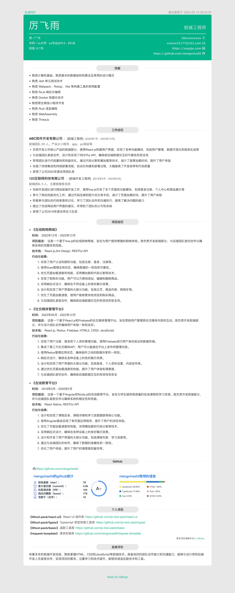
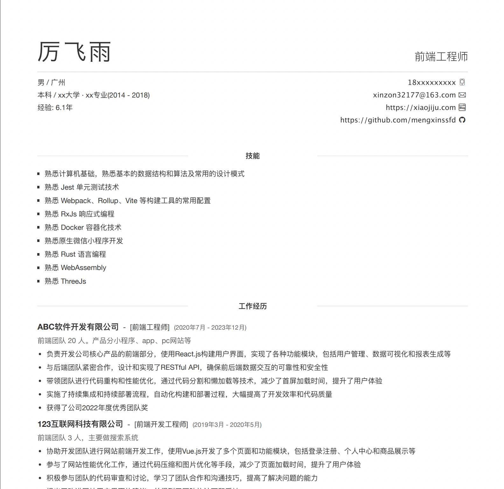

# resume-starter

简历模板

# 预览

[在线预览](https://mengxinssfd.github.io/resume-starter/)

## 网页预览

## PDF 文件预览

生成的 PDF 文件是没有网页版那样有色彩的，投递的简历简历花里胡俏的可是减分项。

ps：pdf 是没有黑边的，截图的时候不小心截到了，懒得换了

# 使用方法

## 使用项目

1. clone 该项目
2. 运行 `pnpm install` 安装依赖
3. 打开 [src/data.ts](./src/data.ts) 文件，在文件内按需填写自己的信息
4. 运行 `npm run start` 启动项目
   - 点击页面左上角的 `生成PDF` 按钮可生成 PDF 文件
5. 运行 `npm run build` 打包项目

## 使用组件包

该项目已发布到 npm，可直接使用该库 `@mxssfd/resume-starter`,
使用该方式只需直接写自己个人信息即可。

具体例子见 [demo](https://stackblitz.com/edit/vitejs-vite-ycwykt?file=src%2Fmain.tsx)

# 渊源

该简历模板最初版本不是我写的，是于 18年在 github 上找的模板，来源于 https://github.com/gwuhaolin/resume ，
不过现在好像仓库被删掉了。

该项目最初是 webpack + vue2 的结构，且当时只有一个 App.vue 文件，全部东西都集中在一起，
后来我就重构了一遍，把它拆分成各个组件，数据分离出来。

再然后就是改成 vue3 + vite，最后则是现在这版 react + vite 的结构。

该简历模板样式我也没怎么动，感觉这样式还是挺简洁好看的，不过最开始是两栏的，我感觉有点挤就只保留了一栏。
